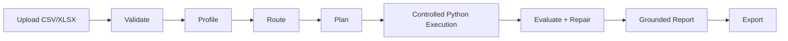

# DataBrief AI

Bounded AI analytics workflow for CSV/XLSX business reports.

DataBrief AI turns spreadsheet uploads into structured business reports through deterministic profiling, semantic role detection, controlled Python execution, bounded repair, and grounded report generation.

[Live Demo](https://data-brief-ai-sigma.vercel.app) · [Case Study](docs/case-study.md)

> Portfolio prototype: this project demonstrates a bounded AI workflow architecture. It is not production SaaS. Generated code is statically checked and executed with resource limits; production use would require OS-level isolation.

## Preview

Portfolio screenshots are stored in `docs/screenshots/` after a demo run.

## What it does

- Upload CSV or XLSX files
- Detect dataset structure and semantic column roles
- Generate a safe, deterministic analysis plan
- Execute controlled Python analysis
- Validate outputs and repair common failures
- Generate grounded business reports
- Export report (Markdown), findings (JSON), and analysis script (Python)

## Architecture



## Why a bounded workflow?

DataBrief AI intentionally uses a bounded AI analytics workflow instead of open-ended automation. Spreadsheet analysis benefits from predictable orchestration, deterministic validation, explicit safety limits, and reproducible outputs.

The workflow uses bounded steps — routing, evaluation, controlled Python execution, bounded repair, and grounded report generation — without allowing arbitrary tool use, web browsing, or open-ended code execution.

**Why workflow:**
- Spreadsheet analysis has a predictable, repeatable structure
- Deterministic profiling and routing eliminate ambiguity before code generation
- Bounded execution with an allowlist prevents unexpected behavior
- Groundedness checks ensure no unsupported claims reach the report

**Why not open-ended automation:**
- Open-ended analysis loops can generate hallucinated KPIs from thin evidence
- Arbitrary tool use in a financial context requires stricter accountability
- Users need to understand and trust each output claim

## Tech stack

| Layer | Technology |
|---|---|
| Frontend | Next.js 16, React 18, TypeScript |
| Backend | FastAPI, Python 3 |
| Analysis | pandas, numpy, matplotlib, seaborn |
| Storage | SQLite (run metadata), local filesystem (artifacts) |
| Deploy | Docker-local · Vercel (demo) |

## Project structure

| Path | Purpose |
|---|---|
| `app/` | Next.js frontend |
| `backend/` | FastAPI API and analysis workflow |
| `backend/services/` | Profiling, planning, code generation, execution, evaluation, reporting |
| `backend/tests/` | Backend tests and semantic quality checks |
| `examples/` | Synthetic demo datasets |
| `docs/` | Case study, screenshots, and architecture notes |

## Run locally

```bash
# Install dependencies
npm install
python3 -m pip install -r backend/requirements.txt

# Optional: XLSX support
python3 -m pip install openpyxl
```

```bash
# Start frontend
npm run dev

# Start backend
cd backend && uvicorn main:app --reload
```

Open `http://localhost:3000`. Copy `.env.example` to `.env` — defaults work for local dev.

## Sample datasets

Download from `examples/` and upload to exercise the workflow:

- `sample_ecommerce.csv` — 30 purchase lines across footwear, sports, and apparel with date, category, quantity, and unit price
- `sample_performance.csv` — 25 sales rep records with territory, product line, revenue, quota, and new-customer flag
- `sample_campaigns.csv` — 26 campaign rows across paid search, social, display, and email with impressions, clicks, conversions, and spend
- `sample_sales.csv` — Simple 4-row sales CSV for quick smoke tests
- `sample_inventory.csv` — Inventory dataset
- `sample_support.csv` — Support ticket dataset

All datasets are synthetic. No real customer or company data.

## Demo flow

1. Start the frontend and backend locally, or open the live demo.
2. Upload `examples/sample_ecommerce.csv`.
3. Review the report metrics, findings, charts, recommendations, and limitations.
4. Download the Markdown report, JSON findings, or generated Python analysis script.

## Testing

```bash
# Linting and type checks
npm run lint
npm run typecheck

# Full test suite
pytest -q

# Semantic quality and planner tests
pytest backend/tests/test_semantic_quality.py backend/tests/test_semantic_profile.py backend/tests/test_planner.py -q

# Python syntax check
python3 -m compileall backend
```

> XLSX tests require `openpyxl`. If not installed, those tests are skipped with a clear message.

## API

- `GET /health`
- `POST /api/upload` — multipart field `file` (CSV or XLSX)
- `GET /api/runs/{run_id}/export/report.md`
- `GET /api/runs/{run_id}/export/findings.json`
- `GET /api/runs/{run_id}/export/analysis.py`

## Current limitations

- **Portfolio prototype, not production SaaS.** Focused feature set; not hardened for arbitrary untrusted input at scale.
- **No OS-level sandbox isolation.** Generated code is statically checked and executed with resource limits, but OS-level network/filesystem isolation is not implemented. Production use would require container isolation, network namespace restrictions, and stronger process sandboxing.
- **No order-level metrics without an order ID.** True order count and average order value require an order ID column; without one, the workflow uses "purchase line count" and flags the limitation.
- **Return/cancel rate requires a status field.** Without a return, refund, cancel, or status column, the metric is labeled "Unavailable."
- **Analysis quality depends on detectable column roles.** Ambiguous or non-standard column names degrade routing and plan quality.
- **No open-ended reasoning loop.** The pipeline is deterministic and orchestrated; it does not reason freely across unknown schemas.
- **Single-run, no memory.** Each upload is independent; no cross-run analysis or session persistence.
- **File size cap.** Demo deployment caps uploads at 5 MB; large files require local deployment.

## Future improvements

- True OS-level sandbox isolation (Docker or seccomp)
- Streaming workflow status to the frontend
- Persistent run history for multi-upload comparison
- User-configurable analysis focus
- Support for multi-sheet XLSX files
- Richer evaluation fixture suite

## Deploy to Vercel

This repo uses Vercel Services to deploy the Next.js frontend and FastAPI backend from a single repository.

1. Import the repo into Vercel. `vercel.json` configures both services automatically.
2. In **Project Settings → Environment Variables**, set:
   - `NEXT_PUBLIC_API_BASE_URL` → `/backend`
   - `DATABRIEF_ENV` → `production`
   - `DATABRIEF_MAX_UPLOAD_MB` → `5`
   - `DATABRIEF_CORS_ORIGINS` → `https://<your-domain>.vercel.app`
3. Deploy.

> Vercel's serverless runtime has request-size, memory, timeout, and ephemeral-filesystem limits. Artifact files and the SQLite run store are not persisted across invocations. Suitable for live demos, not long-term artifact storage.

## Architecture notes

See [docs/architecture.md](docs/architecture.md) and [docs/case-study.md](docs/case-study.md) for detailed design notes.
